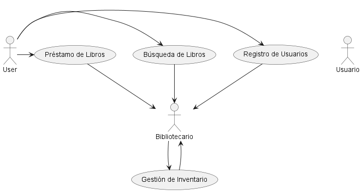
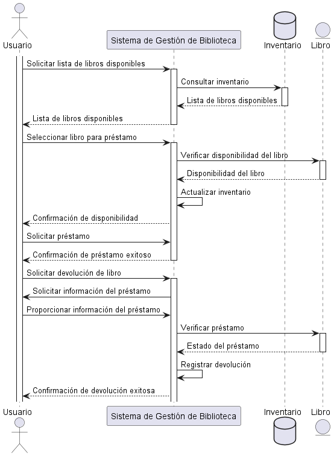
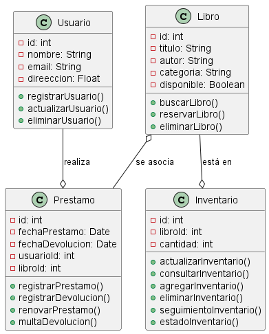

## Sistema de Gestión de Biblioteca

1. RF1:
* Registro de Usuarios
-El sistema debe permitir a los usuarios registrarse proporcionando información básica como nombre,
dirección.y correo electrónico.
-Debe validar la dirección de correo electrónico para evitar registros duplicados.
-Debe generar un número de identificación único para cada usuario registrado.
-Debe permitir a los usuarios elegir una contraseña segura para acceder a sus cuentas.
-Debe proporcionar retroalimentación inmediata en caso de errores durante el proceso de registro.

2. RF2:
* Búsqueda de Libros
-El sistema debe permitir a los usuarios buscar libros por título, autor.o categoría.
-Debe mostrar resultados de búsqueda relevantes de manera clara y concisa.
-Debe proporcionar opciones de filtro para refinar la búsqueda, como por año de publicación o idioma
-Debe permitir a los usuarios ver la disponibilidadi de los libros encontrados en la biblioteca.
-Debe permitir a los usuarios realizar, reservas de libros disponibles.

3. RF3: 
* Préstamo de Libros
-El sistema debe permitir a los usuarios solicitar el préstamo de libros disponibles.
-Debe gestionar el proceso de préstamo, incluyendo la asignación de fechas de vencimiento
-Debe enviar recordatorios automáticos a los usuarios sobre la fecha de vencimiento del préstamo.
-Debe permitir a los usuarios renovar los préstamos si no hay reservas pendientes para el libro.
-Debe generar multas por devoluciones tardias según la politica de la biblioteca.

4. RF4:
* Gestión de Inventario
-El sistema debe mantener un registro actualizado de todos los libros en la biblioteca
-Debe permitir a los bibliotecarios agregar nuevos libros al inventario, incluyendo información detallada
como ISBN, autor y año de punlicación.
-Debe permitir la eliminación de libros obsoletos o dañados del inventario.
-Debe proporcionar herramientas para realizar un seguimiento del estado fisico de los libros, como su ubicación en la biblioteca.
-Debe generar informes periodicos sobre el estado del inventario las tendencias del prestamo

> Ver aqui 

> ver aqui
 

> ver aqui
 